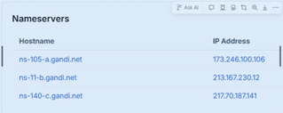

Lab 1: Basic Recon & Scope Validation
Objective: Identify ownership, infrastructure, and exposed surface area.
Steps:
•	WHOIS lookup
•	DNS / subdomain discovery
•	Identify tech stack
Artifacts:
•	Recon summary (5 bullets)
Deliverable: Short recon report
MINI REPORT TEMPLATE
Finding: Running nslookup returns
 
Risk Impact:
Evidence:
Recommendation:
Capture:
•	Organization / Registrar - Gandi SAS
•	Country - France
•	Name servers

•	Registration date (age) –
 

 
•	Who appears to own it? Invicti Security Limited
•	Is it cloud-hosted? Yes AWS, and google
•	Is anything intentionally hidden? Contact information is redacted for privacy.
Got some experience using crt.sh
It shows domains and subdomains that have TLS/SSL certificates, which often reveals hidden or forgotten subdomains — without touching the target.
 
 
Certificate transparency log analysis using crt.sh (Identity LIKE search) returned no results for vulnweb.com subdomains. This suggests that no publicly logged TLS certificates exist for subdomains under this domain or that certificates do not expose subdomain identities. This limits CT-based visibility but does not imply absence of subdomains.
Ran another scan with https://dnsdumpster.com/
Just from the names alone, we can infer:
Subdomain	Likely Purpose
testphp	PHP test application
testasp	ASP test app
testaspnet	ASP.NET app

testhtml5	Front-end test
antivirus1	Security-related service
virus, viruswall	Malware simulation
tetphp	Likely typo / legacy system 🔥
www.test.php	Poor naming hygiene 🔥
Those 🔥 entries are real-world red flags.
________________________________________
Subdomains Identified
•	Multiple test and demonstration subdomains discovered, including PHP, ASP, ASP.NET, and HTML5 applications
•	Presence of security-themed subdomains (antivirus, virus, viruswall)
•	Identified naming inconsistencies and likely legacy or typo-based subdomains (e.g., tetphp, www.test.php)
•	Indicates broad exposed surface area across multiple technologies
Recon Summary – vulnweb.com
•	Domain hosts multiple test and demonstration subdomains across different technologies (PHP, ASP, ASP.NET, HTML5)
•	Subdomain naming suggests intentionally vulnerable applications used for testing and research
•	Several subdomains indicate security or malware simulation services
•	Inconsistent and typo-based subdomain naming observed, which could represent legacy or unmanaged assets
•	Broad exposed surface area identified through passive DNS-based enumeration
________________________________________
📄 Short Recon Report (Final Deliverable)
Target: vulnweb.com
Recon Type: Passive Enumeration
Summary:
Passive reconnaissance identified numerous subdomains under vulnweb.com, including multiple technology-specific test applications and security-themed services. Subdomain naming conventions suggest the environment is intentionally designed for vulnerability testing. The presence of inconsistent and typo-based subdomains indicates a wide and potentially unmanaged attack surface, which would warrant further scoped enumeration in a real engagement.
Risk Level: Low (Test Environment)
Next Steps: Scoped enumeration of individual subdomains and application endpoints

